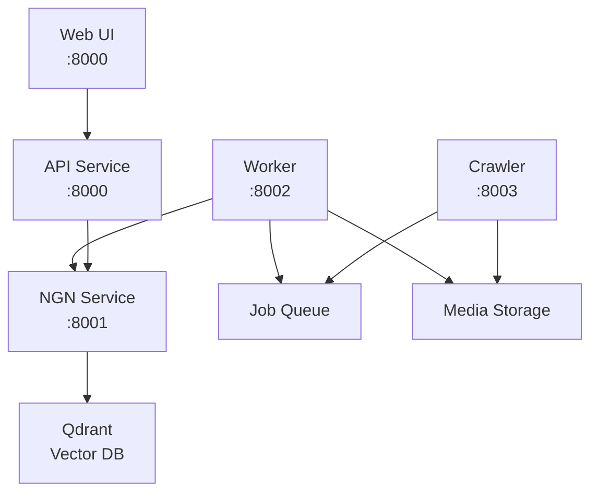

# vesr-architecture-specification
Production specification for a decoupled, multimodal AI intelligence platform aligning text, image, video, and acoustic streams into a unified 512D vector space

# VESR - Cross-Modal Intelligence Platform

VESR (Vector Emebedding Search and Retrieval) is a cutting-edge multimodal search platform that revolutionizes how you discover and interact with information across different media types. Our advanced AI technology seamlessly connects text, images, audio, and video content through sophisticated embedding models and neural networks.

## ✨ Key Features

### 🔍 **Semantic Cross-Modal Search**
- **Text Search**: Natural language queries with semantic understanding using BGE embeddings (512D with PCA compression)
- **Image Search**: Upload images to find visually similar content using CLIP embeddings  
- **Audio Search**: **wav2clip integration** for true cross-modal audio-text semantic search (shares CLIP embedding space)
- **Video Search**: **Multi-frame analysis** with CLIP + Whisper for comprehensive video understanding
- **Document Search**: PDF, DOC, TXT processing with intelligent text extraction

### 🧠 **Advanced AI Capabilities**
- **Semantic Understanding**: AI that understands meaning, not just keywords
- **Cross-Modal Queries**: Search audio content with text queries, find images from audio descriptions
- **Span Search**: Advanced clustering and recursive search for discovery
- **Real-time Processing**: Lightning-fast search results powered by optimized neural networks

### 🏗️ **Production-Ready Architecture**
- **Microservices Design**: Scalable containerized services
- **Background Processing**: Automated media ingestion pipeline
- **Web Crawler**: Automated media discovery and download from websites
- **REST API**: Full-featured API with OpenAPI documentation
- **Modern Web UI**: Beautiful, responsive interface for all search capabilities

## 🚀 Quick Start

### Prerequisites

- **Docker & Docker Compose** (required)
- **8GB+ RAM** for ML models
- **Internet connection** for model downloads on first startup
- **Git** for repository access

### 1. Clone and Setup

```bash
git clone <repository-url>
cd VESR

# Copy environment configuration
cp env.example .env
# Edit .env with your Qdrant credentials if needed
```

### ~~2. Download Required Models~~ *(Historical - Models now download automatically)*

**Important Historical Note**: Previously, manual model downloads were required before starting services.

```bash
# ⚠️ DEPRECATED - Models now download automatically on first startup
# cd ngn
# poetry install
# poetry run python scripts/download_models.py
# poetry run python scripts/test_model_loading.py
```

**Current Behavior**: Models are downloaded automatically from HuggingFace Hub on first startup and cached locally for subsequent runs. Manual pre-download capability will return in future versions.

### 2. Start Services

```bash
# Start all services (models download automatically on first run)
docker compose up -d

# View logs
docker compose logs -f
```

**First Startup**: The NGN service will automatically download required ML models (~2-5 minutes depending on connection).

### 3. Access Services

- **🌐 Web Interface**: http://localhost:8000
- **📖 API Documentation**: http://localhost:8000/docs  
- **🧠 NGN Service**: http://localhost:8001 (ML/AI operations)
- **⚙️ Worker Service**: http://localhost:8002 (background processing)
- **🕷️ Crawler Service**: http://localhost:8003 (web crawling)

## 🏗️ Architecture

VESR uses a **microservices architecture** with four specialized services:



### Service Overview

| Service | Port | Purpose | Technology |
|---------|------|---------|------------|
| **API** | 8000 | Web UI & REST API | FastAPI, HTML/CSS/JS |
| **NGN** | 8001 | ML/AI Operations | FastAPI, PyTorch, HuggingFace |
| **Worker** | 8002 | Background Processing | FastAPI, Job Queue |
| **Crawler** | 8003 | Web Media Discovery | FastAPI, BeautifulSoup |

### Data Flow

1. **🕷️ Crawler** discovers and downloads media files from websites
2. **📝 Jobs** are queued in shared pipeline (`pipeline.json`)
3. **⚙️ Worker** processes jobs and calls NGN for embedding generation
4. **🧠 NGN** generates embeddings and stores in Qdrant vector database
5. **🔍 Search** queries are processed through NGN and returned via API

## 🤖 AI Models & Capabilities

### Core Models (Auto-downloaded)

| Model | Purpose | Dimensions | Special Features |
|-------|---------|------------|------------------|
| **BGE** (BAAI/bge-base-en-v1.5) | Text embeddings | 512D (PCA compressed) | Multilingual support |
| **CLIP** (openai/clip-vit-base-patch32) | Image/Video | 512D | Vision-language alignment |
| **wav2clip** | Audio embeddings | 512D | **Shares CLIP space for cross-modal search** |
| **Whisper** (openai/whisper-base) | Audio transcription | N/A | Multilingual speech-to-text |

### Model Download & Storage

**Current Behavior**: Models are automatically downloaded from HuggingFace Hub on first startup and cached locally for subsequent runs.

**Historical Reference**: Manual model pre-download scripts are available for future offline deployment scenarios:

```bash
# Manual download scripts (available but not required currently)
cd ngn
poetry run python scripts/download_models.py      # Download all models
poetry run python scripts/test_model_loading.py   # Verify models work
```

**Model Storage**: Cached in container's HuggingFace directory:
```
/app/.cache/huggingface/hub/
├── models--BAAI--bge-base-en-v1.5/
├── models--openai--clip-vit-base-patch32/  
└── models--openai--whisper-base/
```

**Future**: Offline mode and manual pre-download capabilities will return as configuration options for air-gapped deployments.

### 🎯 **Cross-Modal Search Capabilities**

**True Semantic Audio Search** (Fixed in latest version):
- ✅ **wav2clip Integration**: Audio embeddings share CLIP's semantic space
- ✅ **Text → Audio**: Search audio content using text queries like "music", "speech"
- ✅ **Audio → Text**: Find relevant documents from audio queries
- ✅ **Multi-Modal**: Combine text, image, and audio queries seamlessly

**Enhanced Video Processing**:
- ✅ **Multi-Frame Extraction**: Up to 5 frames per video for comprehensive analysis
- ✅ **Temporal Understanding**: Frame averaging for better video representation
- ✅ **Audio + Visual**: Combined CLIP + Whisper processing

## 📡 API Reference

### Main Search Endpoints

```bash
# Text search
curl -X POST "http://localhost:8001/search/text" \
  -H "Content-Type: application/json" \
  -d '{"query": "machine learning", "limit": 10}'

# Image search (upload)
curl -X POST "http://localhost:8001/search/image" \
  -F "image=@photo.jpg" -F "limit=5"

# Audio search (upload) - NEW: Cross-modal capability
curl -X POST "http://localhost:8001/search/audio" \
  -F "audio=@sound.mp3" -F "limit=5"

# Video search (upload) - Enhanced multi-frame
curl -X POST "http://localhost:8001/search/video" \
  -F "video=@clip.mp4" -F "limit=5"
```

### Upload & Ingestion

```bash
# Upload for processing
curl -X POST "http://localhost:8001/upload/image" \
  -F "file=@image.jpg" \
  -F 'metadata={"category":"photo","source":"manual"}'
```

## 🧪 Testing & CLI

### VESR CLI Tool

Professional command-line interface for crawler control and media ingestion:

```bash
# Install CLI dependencies
cd scripts
pip install -r requirements.txt  # typer, rich, httpx

# Crawler operations
python vesr_cli.py crawl https://example.com --max-depth 3
python vesr_cli.py tasks                    # List crawler tasks
python vesr_cli.py status <task-id>         # Check task status
python vesr_cli.py stop <task-id>           # Stop running task

# Direct media ingestion
python vesr_cli.py ingest photo.jpg --media-type image
python vesr_cli.py ingest document.pdf --media-type text
python vesr_cli.py ingest audio.mp3 --media-type audio
```

### Test Assets

Test files are available in `ngn/test/assets/`:
- `test.jpeg` - Sample image
- `audio.m4a` - Short audio clip  
- `talking-coffee.mp3` - Speech audio
- `coffee.mp4` - Sample video
- `test.pdf` - Document sample

### Testing Audio Processing

```bash
# Test wav2clip integration (fixed dtype issues)
docker exec vesr-vesr-ngn-1 python -c "
from vesr_ngn.EmbdNGN.audioEmbd import Wav2CLIPAudioEmbedder
embedder = Wav2CLIPAudioEmbedder()
with open('test/assets/audio.m4a', 'rb') as f:
    result = embedder.embed_audio_from_bytes(f.read())
print(f'Success: {len(result)}D embedding generated')
"
```

## 🔧 Development

### Branch Structure

- **`code-restructure`** (current): Production-ready microservices architecture
- **`dev`**: Original monolithic implementation (reference only)
- **`apply-gitignore`**: Cleanup branch

### Local Development

#### Using Docker (Recommended)
```bash
# Development with hot reload
docker compose up

# View specific service logs
docker compose logs -f vesr-ngn
```

#### Native Development
```bash
# NGN Service
cd ngn
poetry install
poetry run python vesr_ngn/main.py

# API Service  
cd api
poetry install
poetry run python vesr_api/main.py

# Worker Service
cd worker
poetry install
poetry run python vesr_worker/main.py

# Crawler Service
cd crawler
poetry install
poetry run python vesr_crawler/main.py
```

### Environment Configuration

Create `.env` from `env.example`:

```env
# Qdrant Configuration
QDRANT_URL=https://your-qdrant-instance:6333
QDRANT_API_KEY=your-api-key
QDRANT_COLLECTION_NAME=vesr_collection_512

# Model Configuration  
CLIP_MODEL_NAME=openai/clip-vit-base-patch32
WHISPER_MODEL_NAME=openai/whisper-base
BGE_MODEL_NAME=BAAI/bge-base-en-v1.5

# Span Search Configuration
SPAN_SEARCH_TOP_K=5
SPAN_SEARCH_MAX_CONCURRENT=10
SPAN_SEARCH_MAX_DEPTH=3
SPAN_SEARCH_SIMILARITY_THRESHOLD=0.7
```

### Development Tools

```bash
# Code formatting
cd ngn && poetry run black vesr_ngn/
cd api && poetry run black vesr_api/

# Type checking
cd ngn && poetry run mypy vesr_ngn/

# Testing
cd ngn && poetry run pytest tests/
```

## 🕷️ Web Crawler Usage

### Start Crawling Task

```bash
curl -X POST "http://localhost:8003/crawl" \
  -H "Content-Type: application/json" \
  -d '{
    "url": "https://example.com",
    "max_depth": 3,
    "delay": 1.0,
    "allowed_domains": ["example.com"],
    "media_types": ["images", "videos", "audio", "texts"]
  }'
```

### Monitor Progress

```bash
# Task status
curl "http://localhost:8003/crawl/{task_id}"

# Queue status  
curl "http://localhost:8003/queue/status"

# Downloaded files
curl "http://localhost:8003/downloads"
```

## ⚙️ Worker Management

### Monitor Processing

```bash
# Worker status
curl "http://localhost:8002/status"

# Queue management
curl "http://localhost:8002/queue/status"
curl -X POST "http://localhost:8002/queue/clear-completed"
curl -X POST "http://localhost:8002/worker/restart"
```

### Job Queue Structure

Located at `shared-job-queue/pipeline.json`:

```json
{
  "pending": [
    {
      "id": "job-uuid",
      "filepath": "/app/data/downloads/images/file.jpg", 
      "filename": "file.jpg",
      "category": "images",
      "source_url": "https://example.com",
      "media_url": "https://example.com/image.jpg",
      "timestamp": "2024-01-01T00:00:00"
    }
  ],
  "processing": [],
  "completed": [],
  "failed": []
}
```

## 📊 Current Status & Recent Fixes

### ✅ **Recently Resolved**

1. **Audio Processing Issue**: Fixed wav2clip dtype mismatch (float64 → float32)
2. **Cross-Modal Audio Search**: Restored wav2clip for true semantic audio-text search
3. **Video Processing**: Enhanced multi-frame extraction (up to 5 frames per video)
4. **Short Audio Handling**: Added padding for audio files < 512 samples

### 🎯 **Verified Capabilities**

- ✅ **Cross-Modal Search**: Text queries can find relevant audio content
- ✅ **Audio Semantic Understanding**: wav2clip shares CLIP embedding space
- ✅ **Multi-Frame Video**: Better video representation through frame averaging
- ✅ **Production Ready**: All services healthy and processing media

## 🚀 Future Enhancements

### Near-Term
- **Redis Job Queue**: Replace file-based queue with Redis
- **Distributed Workers**: Multiple worker instances for scalability
- **Metrics Dashboard**: Prometheus/Grafana integration
- **WebSocket Notifications**: Real-time job status updates

### Long-Term  
- **Kubernetes Deployment**: Production K8s manifests
- **Advanced Video Analysis**: Temporal understanding and scene detection
- **Content Deduplication**: Perceptual hashing for duplicate detection
- **Multi-Language Support**: Extended language model support
- **Advanced Filtering**: Content-based filtering and categorization

## 📈 Performance & Scale

### Resource Requirements

| Component | CPU | Memory | Storage | Notes |
|-----------|-----|--------|---------|-------|
| NGN Service | 2+ cores | 4-8GB | 5GB | ML model loading |
| API Service | 1 core | 512MB | 100MB | Lightweight FastAPI |
| Worker | 1 core | 1GB | Variable | Processing queue |
| Crawler | 1 core | 512MB | Variable | Download storage |

### Throughput

- **Text Search**: ~100-500 queries/second
- **Image Processing**: ~5-20 images/second  
- **Audio Processing**: ~2-10 files/second (depending on length)
- **Video Processing**: ~1-5 videos/second (depending on length/resolution)

---

## 📄 License

This project is licensed under the MIT License - see the LICENSE file for details.

---

**VESR** - *Bridging the gap between different modalities of information through advanced AI.*
